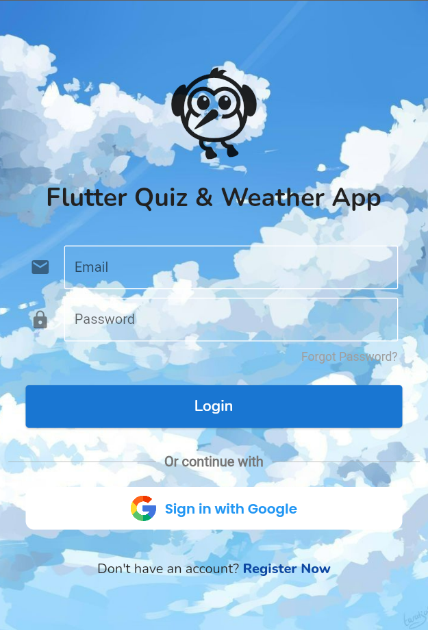
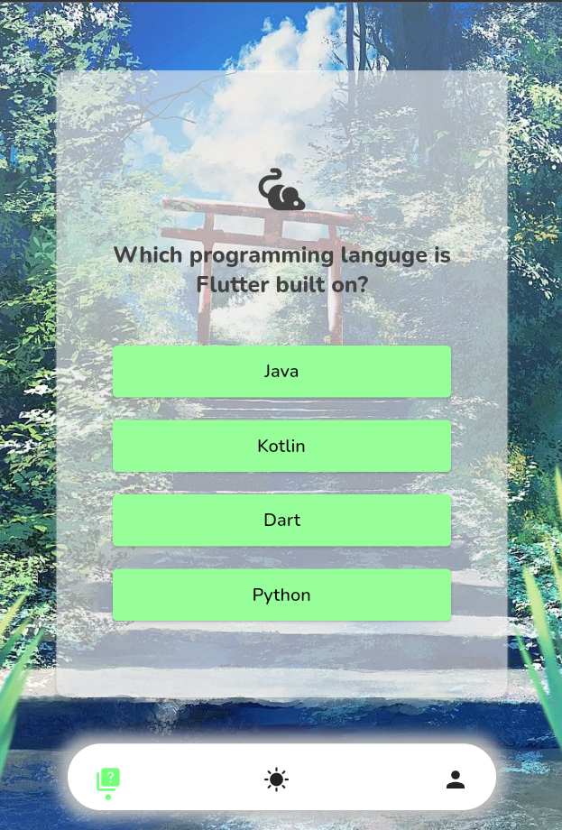
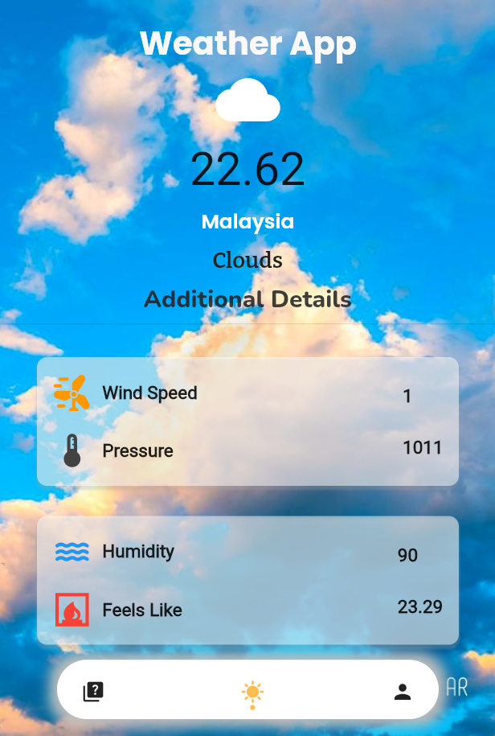

# __Flutter Quiz and Weather app__

A flutter application consist of quiz and realtime weather data where I get to learn the fundamentals of Dart and Flutter along with working in FlutterFire CLI 

Page included:
- Quiz app
- Weather app
- Profile page

## __Screenshots__
Login Page | Quiz Page | Weather Page
:---------:|:---------:|:---------:
 | |

## Getting Started

This project is a starting point for a Flutter application.

A few resources to get you started if this is your first Flutter project:

- [Lab: Write your first Flutter app](https://docs.flutter.dev/get-started/codelab)
- [Cookbook: Useful Flutter samples](https://docs.flutter.dev/cookbook)

For help getting started with Flutter development, view the
[online documentation](https://docs.flutter.dev/), which offers tutorials,
samples, guidance on mobile development, and a full API reference.
